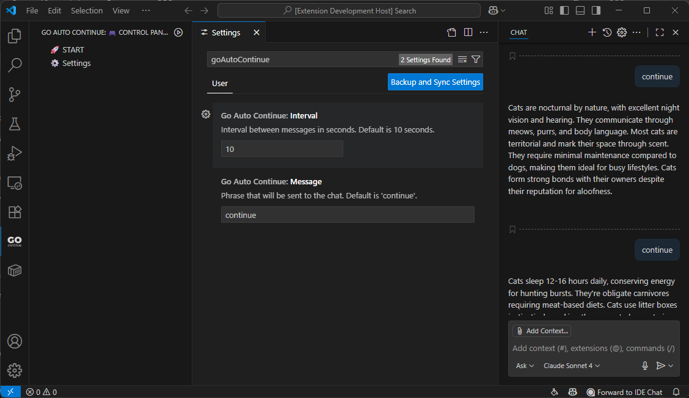

# 🤖 Go Auto Continue

> Auto-Continue Extension for VS Code/Cursor AI Conversations

[](https://marketplace.visualstudio.com/items?itemName=dealenx.go-auto-continue)
[](https://marketplace.visualstudio.com/items?itemName=dealenx.go-auto-continue)
[](https://marketplace.visualstudio.com/items?itemName=dealenx.go-auto-continue)
[](https://github.com/dealenx/go-auto-continue)


*Control panel interface showing start/stop functionality and settings*


## 📝 Description

A lightweight VS Code extension that automatically helps you continue AI conversations when they hit limitations or pause. Perfect for seamless workflow with AI coding assistants like Cursor.

## Demo 

https://private-user-images.githubusercontent.com/4071686/476383611-b3856516-54d0-43db-be6e-8b87342e67b4.mp4

*Watch the extension in action: automatic chat continuation*

### Key Features Demonstrated:
- 🎮 **Easy Control**: One-click start/stop from sidebar
- ⚙️ **Configurable Settings**: Custom intervals and messages  
- 🔄 **Real-time Status**: Visual feedback when active
- 🌍 **Multilingual UI**: Interface adapts to your language

## 🚀 Features

- ⚡ **Auto-Continue**: Automatically sends "continue" command to AI chat
- 🎮 **Control Panel**: Start/stop with one click from the sidebar
- ⚙️ **Configurable Settings**: Customizable interval and message text
- 🌍 **Multilingual UI**: Support for Russian and English interface
- 🎨 **Custom Icon**: Stylish GO icon in the Activity Bar
- 🔄 **Quick Commands**: Fast control through VS Code command palette

## 📦 Installation

### Install from VS Code Marketplace

[](https://marketplace.visualstudio.com/items?itemName=dealenx.go-auto-continue)

**Quick Install:**
1. Open VS Code
2. Go to Extensions (Ctrl+Shift+X)
3. Search for "Go Auto Continue"
4. Click Install

**Or install via command line:**
```bash
code --install-extension dealenx.go-auto-continue
```

### Development Installation

1. **Clone the repository**:
   ```bash
   git clone https://github.com/dealenx/go-auto-continue.git
   cd go-auto-continue
   ```

2. **Install dependencies**:
   ```bash
   npm install
   ```

3. **Compile the extension**:
   ```bash
   npm run compile
   ```

4. **Test in development mode**:
   - Press `F5` in VS Code to launch Extension Development Host

5. **Install for regular use**:
   ```bash
   npm install -g vsce
   vsce package
   code --install-extension go-auto-continue-0.0.2.vsix
   ```

## 🎯 How It Works

The extension provides a simple control panel in VS Code's Activity Bar where you can:

1. **Start Auto-Continue**: Click the start button to begin automatic message sending
2. **Configure Settings**: Set custom interval (1-60 seconds) and message text
3. **Monitor Status**: Visual indicators show when the extension is active
4. **Stop Anytime**: One-click stop when you need manual control

### Default Settings
- **Interval**: 10 seconds between messages
- **Message**: "continue"
- **Auto-start**: Disabled (manual control)

## ⚙️ Configuration

Access settings through:
- Click the settings button in the control panel
- Or go to `File > Preferences > Settings` and search for "Go Auto Continue"

Available settings:
- `goAutoContinue.interval`: Time between messages (1-60 seconds)
- `goAutoContinue.message`: Text to send (default: "continue")

## 🚀 Usage

1. Open VS Code/Cursor with an AI chat active
2. Look for the GO icon in the Activity Bar (left sidebar)
3. Click to open the control panel
4. Click "START" to begin auto-continue mode
5. The extension will automatically send your configured message at set intervals
6. Click "STOP" when you want to resume manual control

## 🛠️ Development

### Project Structure
```
go-auto-continue/
├── src/
│   ├── extension.ts      # Main extension logic
│   └── i18n.ts          # Internationalization
├── resources/
│   └── go-icon.svg      # Custom icon
├── package.json         # Extension manifest
├── package.nls.json     # English translations
├── package.nls.ru.json  # Russian translations
└── tsconfig.json        # TypeScript config
```

### Building from Source
```bash
git clone https://github.com/dealenx/go-auto-continue.git
cd go-auto-continue
npm install
npm run compile
npm run watch  # For development
```


## 🚀 Development & Releases

### Installing from VSIX

1. Download the latest `.vsix` file from [GitHub Releases](https://github.com/dealenx/go-auto-continue/releases)
2. Open VS Code
3. Go to Extensions view (`Ctrl+Shift+X`)
4. Click "..." menu → "Install from VSIX..."
5. Select the downloaded `.vsix` file

### Contributing

1. Fork the repository
2. Create your feature branch (`git checkout -b feature/amazing-feature`)
3. Commit your changes (`git commit -m 'Add some amazing feature'`)
4. Push to the branch (`git push origin feature/amazing-feature`)
5. Open a Pull Request

### Local Development

```bash
# Clone the repository
git clone https://github.com/dealenx/go-auto-continue.git
cd go-auto-continue

# Install dependencies
npm install

# Build the extension
npm run compile

# Package for testing
npm run package

# Test locally
.
elease-test.ps1 -Version 0.0.3 -Install
```

## 📄 License

This project is licensed under the MIT License - see the [LICENSE](LICENSE) file for details.

## 🔗 Links

- [VS Code Marketplace](https://marketplace.visualstudio.com/items?itemName=dealenx.go-auto-continue)
- [GitHub Repository](https://github.com/dealenx/go-auto-continue)
- [Issues & Bug Reports](https://github.com/dealenx/go-auto-continue/issues)

## ⭐ Support

If you find this extension helpful, please consider:
- ⭐ Starring the repository
- 🐛 Reporting bugs
- 💡 Suggesting new features
- 📢 Sharing with others

---

*This extension is not officially affiliated with VS Code or any AI assistant provider.*